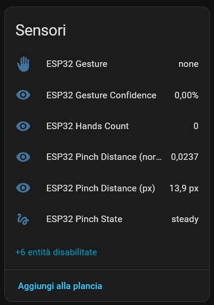

# ESP32-S3 CAM → Gesture Server (MediaPipe + MQTT + Home Assistant)

[](./LICENSE)
[](https://github.com/giosci1994/ESP32-S3_CAM/actions)
[](https://github.com/giosci1994/ESP32-S3_CAM/pkgs/container/ESP32-S3_CAM)

> Stream MJPEG da ESP32-S3 + riconoscimento **gesture mani** (MediaPipe) + **pinch distance** (pollice–indice) + **MQTT** con autodiscovery per Home Assistant. UI web con overlay **800×600 @ 25fps**.

<p align="center">
  
</p>

---

## 🔥 Caratteristiche principali

- ✅ **Stream MJPEG** da ESP32-S3/OV2640 → server Docker
- ✋ **Gesture hands** + overlay (peace, ok, rock, point, swipe, …)
- 🤏 **Pinch** (pollice–indice): distanza **px** / **normalizzata** + **trend** (_opening / closing / steady_)
- 📡 **MQTT** con **Home Assistant Discovery** (sensori auto-creati)
- ⚙️ **UI Web** pronta: `/`, `/stream`, `/status`, `/snapshot.jpg`, `/health`
- 🐳 **Docker Compose** e **.env** già pronti (no segreti nel codice)

---

## 🧰 Hardware

- Board **ESP32‑S3** con camera **OV2640** (ESP32‑S3 CAM)
- Rete Wi‑Fi 2.4 GHz
- Un host con **Docker** (AMD64/ARM64) — es. mini‑PC, NAS, RPi4
- (Opzionale) **Home Assistant** + broker **MQTT**

> Nota: Configura il pinout della tua board e preferisci **SVGA 800×600** per la migliore fluidità.

---

## 🧱 Architettura

```text
ESP32-S3 (OV2640)
   │ MJPEG (HTTP)
   ▼
Gesture Server (Docker: Flask + OpenCV + MediaPipe Hands)
   │ Overlay + Feature extraction (gesture + pinch)
   ├── UI Web: / , /stream , /status , /snapshot.jpg , /health
   └── MQTT Publish (Home Assistant Discovery)
           │
           ▼
     Home Assistant (sensori + automazioni)
```

---

## 🚀 Prova rapida (Docker)

### Con docker compose (consigliato)
```bash
cd server
cp .env.example .env
# modifica i placeholder nel file .env (non committare `.env`)
docker compose up -d
# UI: http://<host>:12345/
```

### Variabili principali (.env)
```
SOURCE_URL=http://<IP-ESP32>/stream
MQTT_HOST=<IP-MQTT>
MQTT_PORT=1883
MQTT_USER=<user>
MQTT_PASSWORD=<password>
MQTT_BASE_TOPIC=gesture32
MQTT_DISCOVERY_PREFIX=homeassistant
TARGET_FPS=25
PINCH_DEADZONE_PX=8
PINCH_HISTORY=8
```

---

## 📦 Immagini su GHCR (GitHub Container Registry)

> Workflow già incluso: alla push su `main` builda e pubblica su GHCR.

Pull dell'immagine (esempio variante **pinch**):
```bash
docker pull ghcr.io/giosci1994/ESP32-S3_CAM:http-gesture-mqtt-pinch
docker run --rm -p 12345:12345   -e SOURCE_URL="http://<IP-ESP32>/stream"   -e MQTT_HOST="<IP-MQTT>" -e MQTT_PORT="1883"   -e MQTT_USER="<user>" -e MQTT_PASSWORD="<password>"   -e MQTT_BASE_TOPIC="gesture32"   ghcr.io/giosci1994/ESP32-S3_CAM:http-gesture-mqtt-pinch
```

Tag disponibili (se abilitati nel workflow):
- `ghcr.io/giosci1994/ESP32-S3_CAM:http-gesture`
- `ghcr.io/giosci1994/ESP32-S3_CAM:http-gesture-mqtt`
- `ghcr.io/giosci1994/ESP32-S3_CAM:http-gesture-mqtt-gestures`
- `ghcr.io/giosci1994/ESP32-S3_CAM:http-gesture-mqtt-pinch`

---

## 📡 MQTT + Home Assistant

Sensori via discovery:
- `sensor.esp32_gesture` — label gesto corrente
- `sensor.esp32_gesture_confidence` — confidenza (%)
- `sensor.esp32_hands_count` — mani rilevate
- `sensor.esp32_pinch_distance_px` — distanza pollice‑indice (px)
- `sensor.esp32_pinch_distance_norm` — distanza normalizzata (0..1)
- `sensor.esp32_pinch_state` — `opening` / `closing` / `steady`

## Sensori MQTT

<p align="center">
  <a href="docs/images/sensori_mqtt.jpg">
    
  </a>
</p>

Esempio automazione:
```yaml
alias: Zoom con pinch
trigger:
  - platform: state
    entity_id: sensor.esp32_pinch_state
    to: 'opening'
  - platform: state
    entity_id: sensor.esp32_pinch_state
    to: 'closing'
action:
  - choose:
      - conditions: "{ '{' } is_state('sensor.esp32_pinch_state','opening') { '}' }"
        sequence:
          - service: script.zoom_in
      - conditions: "{ '{' } is_state('sensor.esp32_pinch_state','closing') { '}' }"
        sequence:
          - service: script.zoom_out
mode: restart
```

---

## 🧩 Firmware ESP32 (Arduino IDE)

1. Installa **ESP32** (Espressif) e scegli la tua board **ESP32-S3**.
2. Apri `firmware/esp32s3-cam.ino` e compila i placeholder (SSID/password, eventuale MQTT).
3. Carica e verifica l’URL stream (es. `http://<ESP32-IP>/stream`).

Tips:
- Se VLC non apre l’RTSP, usa direttamente lo stream **HTTP MJPEG** nel browser.
- Per fluidità: qualità JPEG ~80, FPS 25, risoluzione 800×600.

---

## 🛠️ Endpoint del server

- `GET /` — UI (stream + pannello valori)
- `GET /stream` — MJPEG con overlay
- `GET /status` — JSON gesto/pinch
- `GET /snapshot.jpg` — frame singolo (800×600)
- `GET /health` — diagnostica

---

## 🧯 Troubleshooting

- **UI si vede ma niente gesture** → controlla logs container, verifica stream e MediaPipe.
- **No sensori in HA** → conferma broker/credenziali, `discovery_prefix`, e che HA usi lo stesso broker.
- **Frame drop** → riduci `TARGET_FPS`, abbassa qualità JPEG lato ESP32, verifica CPU host.

---

## 🤝 Contribuire

- Vedi **CONTRIBUTING.md**
- Template per **Bug/Feature/PR** in `.github/ISSUE_TEMPLATE/` e `.github/pull_request_template.md`

---

## 📝 Licenza

MIT — vedi `LICENSE`.
